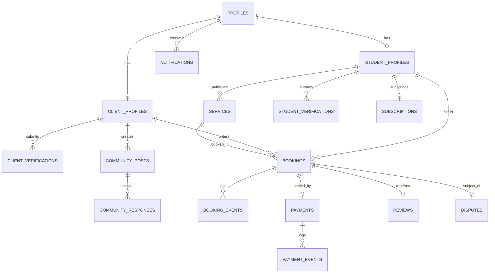

# Database Schema & Relational Model — SkillSetu

## 1. Relational Entity Overview

The schema is built for PostgreSQL / Supabase, utilizing UUID primary keys, foreign key constraints, check constraints, timestamp audit columns, and Row Level Security (RLS) policies.

---

## 2. Table Definitions

### 1. `profiles`
* `id` UUID PRIMARY KEY REFERENCES `auth.users(id)` ON DELETE CASCADE
* `email` TEXT NOT NULL UNIQUE
* `full_name` TEXT NOT NULL
* `avatar_url` TEXT
* `phone` TEXT
* `role` TEXT NOT NULL CHECK (role IN ('student', 'client', 'admin'))
* `created_at` TIMESTAMPTZ DEFAULT NOW()
* `updated_at` TIMESTAMPTZ DEFAULT NOW()

### 2. `student_profiles`
* `id` UUID PRIMARY KEY REFERENCES `profiles(id)` ON DELETE CASCADE
* `skillsetu_id` TEXT NOT NULL UNIQUE (e.g. `SK-ST-104827`)
* `college` TEXT NOT NULL
* `course` TEXT NOT NULL
* `year` TEXT NOT NULL
* `location` TEXT NOT NULL
* `about` TEXT
* `skills` TEXT[] DEFAULT '{}'
* `experience` TEXT
* `education` TEXT
* `availability_days` TEXT[] DEFAULT '{"Mon","Tue","Wed","Thu","Fri","Sat"}'
* `rating` NUMERIC(3,2) DEFAULT 5.00
* `review_count` INT DEFAULT 0
* `completed_bookings_count` INT DEFAULT 0
* `hourly_rate_base` INT DEFAULT 500
* `team_mode_available` BOOLEAN DEFAULT FALSE
* `badges` TEXT[] DEFAULT '{"Verified Student"}'
* `verification_status` TEXT DEFAULT 'pending' CHECK (verification_status IN ('pending', 'under_review', 'verified', 'rejected'))

### 3. `client_profiles`
* `id` UUID PRIMARY KEY REFERENCES `profiles(id)` ON DELETE CASCADE
* `skillsetu_id` TEXT NOT NULL UNIQUE (e.g. `SK-CL-104827`)
* `organization_name` TEXT
* `organization_type` TEXT
* `location` TEXT NOT NULL
* `about` TEXT
* `total_spent` INT DEFAULT 0
* `hired_count` INT DEFAULT 0
* `rating_given_avg` NUMERIC(3,2) DEFAULT 5.00
* `verification_status` TEXT DEFAULT 'verified' CHECK (verification_status IN ('pending', 'under_review', 'verified', 'rejected', 'needs_review'))

### 4. `services`
* `id` UUID PRIMARY KEY DEFAULT gen_random_uuid()
* `student_id` UUID NOT NULL REFERENCES `student_profiles(id)` ON DELETE CASCADE
* `title` TEXT NOT NULL
* `slug` TEXT NOT NULL UNIQUE
* `category` TEXT NOT NULL
* `description` TEXT NOT NULL
* `location` TEXT NOT NULL
* `delivery_mode` TEXT NOT NULL CHECK (delivery_mode IN ('online', 'on_campus', 'both'))
* `price` INT NOT NULL CHECK (price > 0)
* `pricing_unit` TEXT NOT NULL CHECK (pricing_unit IN ('per_hour', 'per_project', 'per_session', 'per_item'))
* `availability_days` TEXT[] DEFAULT '{}'
* `team_service` BOOLEAN DEFAULT FALSE
* `portfolio_urls` TEXT[] DEFAULT '{}'
* `skills` TEXT[] DEFAULT '{}'
* `status` TEXT NOT NULL DEFAULT 'published' CHECK (status IN ('published', 'draft', 'paused'))
* `views_count` INT DEFAULT 0
* `bookings_count` INT DEFAULT 0
* `created_at` TIMESTAMPTZ DEFAULT NOW()

### 5. `bookings`
* `id` UUID PRIMARY KEY DEFAULT gen_random_uuid()
* `booking_code` TEXT NOT NULL UNIQUE (e.g. `RAS-48210`)
* `service_id` UUID NOT NULL REFERENCES `services(id)`
* `student_id` UUID NOT NULL REFERENCES `student_profiles(id)`
* `client_id` UUID NOT NULL REFERENCES `client_profiles(id)`
* `booking_date` DATE NOT NULL
* `time_slot` TEXT NOT NULL
* `duration_hours` INT DEFAULT 1
* `message` TEXT
* `service_price` INT NOT NULL
* `platform_fee` INT NOT NULL
* `total_amount` INT NOT NULL
* `status` TEXT NOT NULL DEFAULT 'CONFIRMED' CHECK (status IN (
    'REQUESTED', 'ACCEPTED', 'PAYMENT_PENDING', 'CONFIRMED',
    'ACTIVE', 'COMPLETED_BY_STUDENT', 'CONFIRMED_BY_CLIENT',
    'CANCELLED', 'DISPUTED', 'RESOLVED'
  ))
* `payment_status` TEXT NOT NULL DEFAULT 'PROTECTED' CHECK (payment_status IN ('PENDING', 'PROTECTED', 'RELEASED', 'REFUNDED'))
* `created_at` TIMESTAMPTZ DEFAULT NOW()
* `updated_at` TIMESTAMPTZ DEFAULT NOW()

### 6. `payments` & `payment_events`
* `id` UUID PRIMARY KEY DEFAULT gen_random_uuid()
* `booking_id` UUID NOT NULL REFERENCES `bookings(id)` ON DELETE CASCADE
* `client_id` UUID NOT NULL REFERENCES `client_profiles(id)`
* `student_id` UUID NOT NULL REFERENCES `student_profiles(id)`
* `amount` INT NOT NULL
* `platform_fee` INT NOT NULL
* `net_student_amount` INT NOT NULL
* `currency` TEXT DEFAULT 'INR'
* `razorpay_order_id` TEXT
* `razorpay_payment_id` TEXT
* `status` TEXT NOT NULL CHECK (status IN ('PENDING', 'PROTECTED', 'RELEASED', 'REFUNDED'))
* `created_at` TIMESTAMPTZ DEFAULT NOW()
* `released_at` TIMESTAMPTZ

### 7. `reviews`
* `id` UUID PRIMARY KEY DEFAULT gen_random_uuid()
* `booking_id` UUID NOT NULL UNIQUE REFERENCES `bookings(id)` ON DELETE CASCADE
* `service_id` UUID NOT NULL REFERENCES `services(id)`
* `student_id` UUID NOT NULL REFERENCES `student_profiles(id)`
* `client_id` UUID NOT NULL REFERENCES `client_profiles(id)`
* `rating` INT NOT NULL CHECK (rating >= 1 AND rating <= 5)
* `review_text` TEXT NOT NULL
* `client_name` TEXT NOT NULL
* `client_org` TEXT
* `created_at` TIMESTAMPTZ DEFAULT NOW()

### 8. `community_posts` & `community_responses`
* `id` UUID PRIMARY KEY DEFAULT gen_random_uuid()
* `client_id` UUID NOT NULL REFERENCES `client_profiles(id)`
* `client_name` TEXT NOT NULL
* `client_org` TEXT
* `title` TEXT NOT NULL
* `category` TEXT NOT NULL
* `description` TEXT NOT NULL
* `budget` INT NOT NULL
* `deadline` TEXT NOT NULL
* `delivery_mode` TEXT NOT NULL CHECK (delivery_mode IN ('online', 'on_campus', 'both'))
* `status` TEXT DEFAULT 'open' CHECK (status IN ('open', 'in_progress', 'closed'))
* `responses_count` INT DEFAULT 0
* `created_at` TIMESTAMPTZ DEFAULT NOW()

### 9. `notifications`
* `id` UUID PRIMARY KEY DEFAULT gen_random_uuid()
* `user_id` UUID NOT NULL REFERENCES `profiles(id)` ON DELETE CASCADE
* `type` TEXT NOT NULL
* `title` TEXT NOT NULL
* `message` TEXT NOT NULL
* `link_url` TEXT NOT NULL
* `is_read` BOOLEAN DEFAULT FALSE
* `created_at` TIMESTAMPTZ DEFAULT NOW()

### 10. `disputes`
* `id` UUID PRIMARY KEY DEFAULT gen_random_uuid()
* `booking_id` UUID NOT NULL REFERENCES `bookings(id)`
* `raised_by_id` UUID NOT NULL REFERENCES `profiles(id)`
* `raised_by_name` TEXT NOT NULL
* `issue_type` TEXT NOT NULL
* `description` TEXT NOT NULL
* `status` TEXT DEFAULT 'reported' CHECK (status IN ('reported', 'under_review', 'resolved', 'refunded', 'released'))
* `created_at` TIMESTAMPTZ DEFAULT NOW()
* `resolved_at` TIMESTAMPTZ
* `resolution_notes` TEXT
