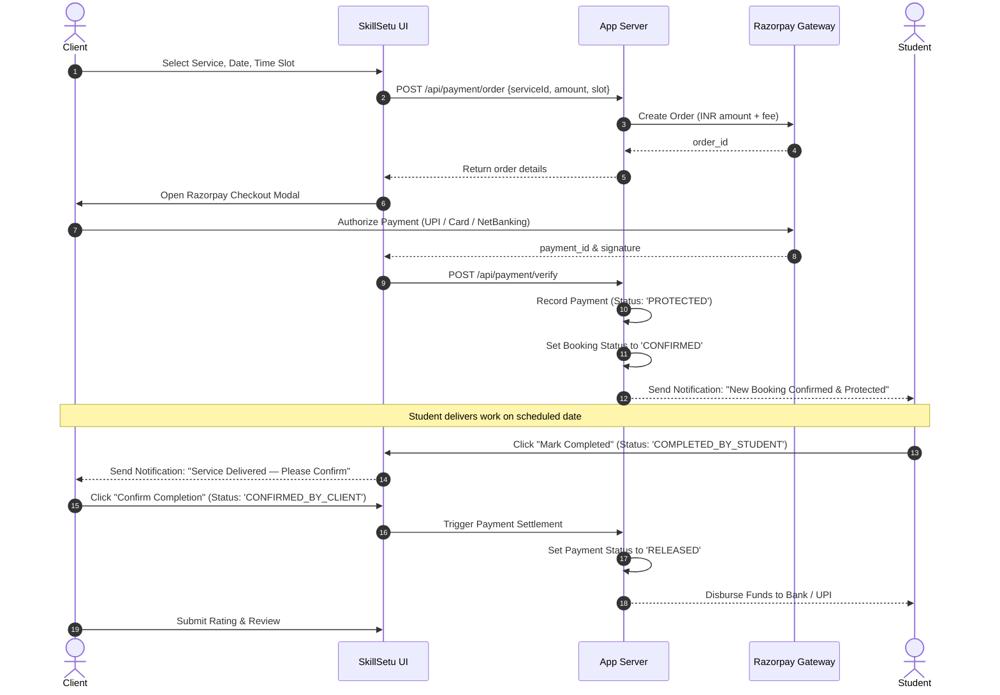

# Payment Protection Flow & Commission Engine — SkillSetu

## 1. Terminology & Compliance
> [!IMPORTANT]
> The word **"escrow"** MUST NEVER appear in visible UI, tooltips, or microcopy. The legally compliant, consumer-friendly terminology is **"Payment Protected"** or **"Payment Secured Until Completion"**.

---

## 2. Platform Commission Model
SkillSetu uses a centralized fee configuration located in `src/config/site.ts`:
* **Client Platform Convenience Fee**: `5.0%` (e.g. On a ₹2,000 service, Platform Fee is ₹100; total paid by client is ₹2,100).
* **Student Payout Rate**: Full service amount disbursed upon client confirmation (or standard student subscription perks with zero deduction).

### Mathematical Calculation
$$\text{Platform Fee} = \text{round}(\text{Service Base Price} \times 0.05)$$
$$\text{Total Client Charged} = \text{Service Base Price} + \text{Platform Fee}$$
$$\text{Student Payout Disbursed} = \text{Service Base Price}$$

---

## 3. End-to-End Payment Lifecycle

---

## 4. Issue & Dispute Safety Buffer
If work is incomplete or unsatisfactory:
1. Client clicks **"Report Issue"** before confirming completion.
2. Booking transitions to `DISPUTED`.
3. Payment remains **PROTECTED**; automated release is halted.
4. Admin reviews dispute evidence in `/admin/disputes` and issues either a full/partial **Refund** or **Release**.
