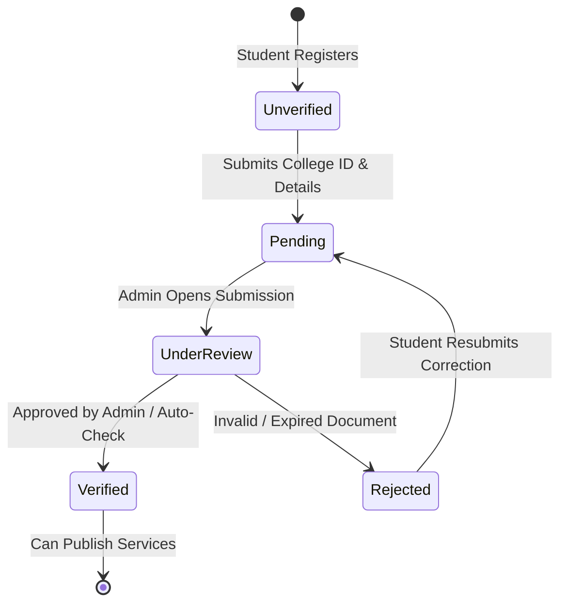

# Verification System Specification — SkillSetu

## 1. Core Verification Principles
SkillSetu builds marketplace confidence by verifying every student provider before they can publish services publicly.

> [!NOTE]
> For development/prototype builds, verification workflows operate via a high-fidelity simulation engine that creates realistic review queues without requiring real Aadhaar or third-party institutional API integrations.

---

## 2. Student Verification Workflow

### Required Student Fields
1. **Full Name** (as printed on College ID)
2. **College / Institution** (e.g. *IIT Bombay, COEP, BITS Pilani, NIFT Mumbai*)
3. **Course & Department** (e.g. *B.Tech Mechanical Engineering, M.Sc Data Science*)
4. **Current Academic Year** (e.g. *2nd Year, 3rd Year, Final Year*)
5. **Student ID / Roll Number** (e.g. *21070123045*)
6. **College Email Address** (e.g. *student@iitb.ac.in*)
7. **College ID Card Document**: Simulated image upload with live document preview.

### Gating Rule
* **Unverified Students**: Can browse marketplace, view dashboard, and prepare drafts. When attempting to publish on `/create`, an alert appears explaining that verification is required, linking to `/verification`.
* **Verified Students**: Earn the **"Verified Student"** badge, unique SkillSetu ID (`SK-ST-104827`), and full publishing access.

---

## 3. Client Verification Workflow
* **Individual Clients**: Email & Phone verification + optional photo ID badge.
* **Corporate / Startup / Event Clients**: Business registration proof / club authorization.
* **Statuses**: `Pending`, `Under Review`, `Verified`, `Rejected`, `Needs Review`.
* **Verified Clients**: Receive the **"Verified Client"** badge and SkillSetu Verification ID (e.g. `SK-CL-104827`).
